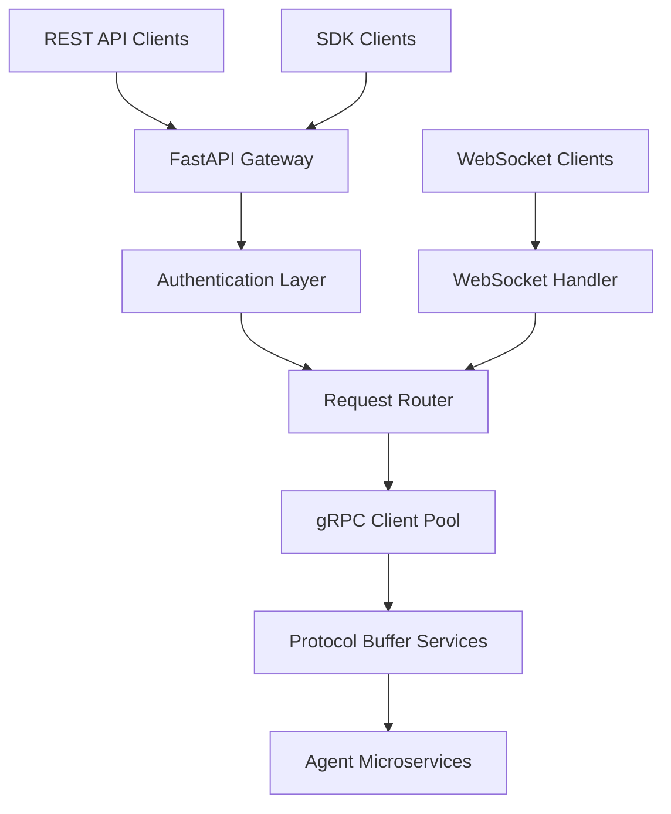

# 🚀 API Agent Smart Call - Enterprise Development Plan

## 📋 **Project Overview**

**API Agent Smart Call** is a production-ready Python library that provides a RESTful interface while internally leveraging gRPC microservices for efficient multi-LLM agent communication.

---

## 🏗️ **Architecture Design**

### **🔄 High-Level Architecture**


### **🎯 Core Design Principles**
- **🔧 Modular Architecture**: Clean separation of concerns
- **⚡ Performance-First**: Async/await throughout, connection pooling
- **🛡️ Security-by-Design**: TLS, authentication, input validation
- **📈 Scalability**: Horizontal scaling, load balancing
- **🔄 Flexibility**: Plugin architecture, dynamic routing
- **🧪 Testability**: Dependency injection, mock services
- **📊 Observability**: Structured logging, metrics, tracing

---

## 📁 **Project Structure** (Industry Standard)

```
api-agent-smart-call/
├── 📦 Core Application
│   ├── src/api_agent_smart_call/
│   │   ├── __init__.py
│   │   ├── main.py                      # FastAPI application entry
│   │   ├── config/
│   │   │   ├── __init__.py
│   │   │   ├── settings.py              # Pydantic settings management
│   │   │   ├── logging.py               # Structured logging config
│   │   │   └── security.py              # Security configurations
│   │   ├── api/
│   │   │   ├── __init__.py
│   │   │   ├── dependencies.py          # FastAPI dependency injection
│   │   │   ├── middleware.py            # Custom middleware
│   │   │   └── v1/
│   │   │       ├── __init__.py
│   │   │       ├── router.py            # Main API router
│   │   │       ├── agents.py            # Agent management endpoints
│   │   │       ├── communication.py     # Agent communication endpoints
│   │   │       ├── streaming.py         # Streaming endpoints
│   │   │       └── websocket.py         # WebSocket handlers
│   │   ├── grpc_clients/
│   │   │   ├── __init__.py
│   │   │   ├── base_client.py           # Base gRPC client class
│   │   │   ├── agent_client.py          # Agent service client
│   │   │   ├── communication_client.py  # Communication service client
│   │   │   └── pool.py                  # Connection pool management
│   │   ├── schemas/
│   │   │   ├── __init__.py
│   │   │   ├── requests.py              # Pydantic request models
│   │   │   ├── responses.py             # Pydantic response models
│   │   │   └── internal.py              # Internal data models
│   │   ├── services/
│   │   │   ├── __init__.py
│   │   │   ├── agent_service.py         # Business logic for agents
│   │   │   ├── communication_service.py # Communication orchestration
│   │   │   ├── routing_service.py       # Dynamic routing logic
│   │   │   └── transform_service.py     # Payload transformation
│   │   ├── core/
│   │   │   ├── __init__.py
│   │   │   ├── security.py              # Auth/authz implementation
│   │   │   ├── exceptions.py            # Custom exception classes
│   │   │   ├── validators.py            # Input validation
│   │   │   └── utils.py                 # Utility functions
│   │   └── monitoring/
│   │       ├── __init__.py
│   │       ├── metrics.py               # Prometheus metrics
│   │       ├── tracing.py               # OpenTelemetry tracing
│   │       └── health.py                # Health check endpoints
│   │
├── 📡 Protocol Buffers
│   ├── protos/
│   │   ├── agent_service.proto          # Agent management service
│   │   ├── communication.proto          # Agent communication protocol
│   │   ├── streaming.proto              # Streaming communication
│   │   ├── common.proto                 # Common message types
│   │   └── health.proto                 # Health check service
│   └── generated/                       # Auto-generated Python files
│       ├── __init__.py
│       └── (auto-generated .py files)
│
├── 🛠️ Development Tools
│   ├── scripts/
│   │   ├── build_protos.py              # Proto compilation script
│   │   ├── start_dev.py                 # Development server
│   │   ├── generate_certs.py            # TLS certificate generation
│   │   └── benchmark.py                 # Performance benchmarking
│   ├── tools/
│   │   ├── buf.yaml                     # Buf configuration
│   │   ├── buf.gen.yaml                 # Buf generation config
│   │   └── proto_validator.py           # Proto schema validation
│   │
├── 🧪 Testing Infrastructure
│   ├── tests/
│   │   ├── __init__.py
│   │   ├── conftest.py                  # Pytest configuration
│   │   ├── unit/
│   │   │   ├── __init__.py
│   │   │   ├── test_services.py
│   │   │   ├── test_grpc_clients.py
│   │   │   └── test_security.py
│   │   ├── integration/
│   │   │   ├── __init__.py
│   │   │   ├── test_api_endpoints.py
│   │   │   ├── test_grpc_communication.py
│   │   │   └── test_streaming.py
│   │   ├── e2e/
│   │   │   ├── __init__.py
│   │   │   └── test_full_workflow.py
│   │   └── load/
│   │       ├── __init__.py
│   │       └── test_performance.py
│   │
├── 📦 SDK & Client Libraries
│   ├── sdk/
│   │   ├── python/
│   │   │   ├── api_agent_client/
│   │   │   │   ├── __init__.py
│   │   │   │   ├── client.py            # Main SDK client
│   │   │   │   ├── async_client.py      # Async SDK client
│   │   │   │   ├── models.py            # SDK data models
│   │   │   │   └── exceptions.py        # SDK exceptions
│   │   │   ├── setup.py                 # SDK package setup
│   │   │   └── README.md                # SDK documentation
│   │   ├── examples/
│   │   │   ├── basic_usage.py
│   │   │   ├── streaming_example.py
│   │   │   ├── async_example.py
│   │   │   └── websocket_example.py
│   │   └── postman/
│   │       └── api_collection.json      # Postman collection
│   │
├── 🐳 Deployment & Infrastructure
│   ├── deployments/
│   │   ├── docker/
│   │   │   ├── Dockerfile               # Multi-stage production build
│   │   │   ├── Dockerfile.dev           # Development build
│   │   │   └── docker-compose.yml       # Local development stack
│   │   ├── kubernetes/
│   │   │   ├── namespace.yaml
│   │   │   ├── deployment.yaml
│   │   │   ├── service.yaml
│   │   │   ├── ingress.yaml
│   │   │   └── configmap.yaml
│   │   └── helm/
│   │       ├── Chart.yaml
│   │       ├── values.yaml
│   │       └── templates/
│   │
├── 🔄 CI/CD Pipeline
│   ├── .github/
│   │   └── workflows/
│   │       ├── ci.yml                   # Continuous Integration
│   │       ├── cd.yml                   # Continuous Deployment
│   │       ├── security-scan.yml        # Security scanning
│   │       └── proto-validation.yml     # Proto file validation
│   ├── .gitlab-ci.yml                   # GitLab CI support
│   └── jenkins/
│       └── Jenkinsfile                  # Jenkins pipeline
│
├── 📚 Documentation
│   ├── docs/
│   │   ├── index.md                     # Main documentation
│   │   ├── quickstart.md                # Getting started guide
│   │   ├── api-reference.md             # API documentation
│   │   ├── grpc-services.md             # gRPC service docs
│   │   ├── security.md                  # Security guidelines
│   │   ├── deployment.md                # Deployment guide
│   │   └── examples/                    # Code examples
│   ├── mkdocs.yml                       # Documentation site config
│   └── openapi.json                     # Auto-generated API spec
│
├── 🔧 Configuration
│   ├── pyproject.toml                   # Modern Python packaging
│   ├── setup.py                         # Fallback setup
│   ├── requirements/
│   │   ├── base.txt                     # Core dependencies
│   │   ├── dev.txt                      # Development dependencies
│   │   ├── test.txt                     # Testing dependencies
│   │   └── prod.txt                     # Production dependencies
│   ├── .env.example                     # Environment template
│   ├── config/
│   │   ├── development.yaml             # Dev configuration
│   │   ├── production.yaml              # Prod configuration
│   │   └── testing.yaml                 # Test configuration
│   │
└── 📄 Project Root Files
    ├── README.md                        # Main project documentation
    ├── CHANGELOG.md                     # Version history
    ├── LICENSE                          # License file
    ├── SECURITY.md                      # Security policy
    ├── CONTRIBUTING.md                  # Contribution guidelines
    ├── .gitignore                       # Git ignore rules
    ├── .pre-commit-config.yaml          # Pre-commit hooks
    ├── .editorconfig                    # Editor configuration
    ├── Makefile                         # Build automation
    └── VERSION                          # Version file
```

---

## 🛠️ **Technology Stack** (Best-in-Class)

### **🐍 Python Framework**
- **FastAPI** (Primary) - Modern, fast, OpenAPI native
- **Uvicorn** - ASGI server with performance focus
- **Pydantic** - Data validation and settings management

### **🔄 gRPC & Protocol Buffers**
- **grpcio** - Official gRPC Python library
- **protobuf** - Google Protocol Buffers
- **buf** - Modern protobuf toolchain
- **grpcio-tools** - Protocol buffer compiler

### **🛡️ Security & Authentication**
- **PyJWT** - JSON Web Token implementation
- **cryptography** - Cryptographic recipes and primitives
- **passlib** - Password hashing utilities
- **python-multipart** - Multipart form data parser

### **⚡ Performance & Async**
- **asyncio** - Native async/await support
- **aioredis** - Async Redis client for caching
- **aiokafka** - Async Kafka client for messaging
- **uvloop** - Fast event loop implementation

### **📊 Monitoring & Observability**
- **prometheus-client** - Metrics collection
- **opentelemetry** - Distributed tracing
- **structlog** - Structured logging
- **sentry-sdk** - Error tracking

### **🧪 Testing & Quality**
- **pytest** - Testing framework
- **pytest-asyncio** - Async testing support
- **coverage** - Code coverage
- **black** - Code formatting
- **ruff** - Fast Python linter
- **mypy** - Static type checking

### **🐳 Deployment & Infrastructure**
- **Docker** - Containerization
- **Kubernetes** - Container orchestration
- **Helm** - Kubernetes package manager
- **Terraform** - Infrastructure as code

---

## 🎯 **Development Phases**

### **Phase 1: Foundation (Week 1-2)**
1. **📁 Project Structure Setup**
   - Initialize project with proper directory structure
   - Configure pyproject.toml with all dependencies
   - Set up pre-commit hooks and code quality tools
   - Create base configuration management

2. **🔧 Protocol Buffer Design**
   - Design comprehensive .proto schemas
   - Set up buf toolchain for proto management
   - Implement proto compilation automation
   - Create versioning strategy for schemas

3. **🏗️ Core Infrastructure**
   - Implement base configuration system
   - Set up structured logging
   - Create custom exception hierarchy
   - Implement dependency injection framework

### **Phase 2: gRPC Foundation (Week 2-3)**
1. **🔌 gRPC Client Infrastructure**
   - Implement base gRPC client with connection pooling
   - Create service-specific client classes
   - Implement retry mechanisms and circuit breakers
   - Add TLS and authentication support

2. **🛡️ Security Implementation**
   - Implement JWT-based authentication
   - Create authorization middleware
   - Add input validation and sanitization
   - Implement rate limiting

3. **📊 Monitoring Foundation**
   - Set up Prometheus metrics
   - Implement health check endpoints
   - Create performance monitoring
   - Add distributed tracing

### **Phase 3: REST API Layer (Week 3-4)**
1. **🌐 FastAPI Application**
   - Create FastAPI application with proper structure
   - Implement API versioning strategy
   - Add comprehensive error handling
   - Create OpenAPI documentation

2. **🔄 Request/Response Handling**
   - Implement Pydantic schemas for validation
   - Create request routing and transformation
   - Add response formatting and streaming
   - Implement caching mechanisms

3. **⚡ WebSocket Support**
   - Implement WebSocket handlers
   - Create real-time event broadcasting
   - Add connection management
   - Implement authentication for WebSocket

### **Phase 4: Advanced Features (Week 4-5)**
1. **🚀 Performance Optimization**
   - Implement async processing throughout
   - Add connection pooling and multiplexing
   - Create efficient payload transformation
   - Optimize for low-latency communication

2. **🔄 Dynamic Routing**
   - Implement plugin architecture
   - Create dynamic service discovery
   - Add load balancing capabilities
   - Implement circuit breaker patterns

3. **📡 Streaming Support**
   - Implement bidirectional streaming
   - Create efficient stream multiplexing
   - Add stream authentication and authorization
   - Implement backpressure handling

### **Phase 5: SDK & Developer Experience (Week 5-6)**
1. **📦 Python SDK**
   - Create intuitive Python client library
   - Implement both sync and async clients
   - Add comprehensive error handling
   - Create extensive code examples

2. **📚 Documentation**
   - Create comprehensive API documentation
   - Write developer guides and tutorials
   - Generate interactive API explorer
   - Create video tutorials and demos

3. **🧪 Testing Suite**
   - Implement comprehensive unit tests
   - Create integration test suite
   - Add end-to-end testing
   - Implement performance/load testing

### **Phase 6: Production Readiness (Week 6-7)**
1. **🐳 Deployment Infrastructure**
   - Create production-ready Dockerfiles
   - Implement Kubernetes manifests
   - Create Helm charts for easy deployment
   - Set up CI/CD pipelines

2. **🔒 Security Hardening**
   - Conduct security audit
   - Implement additional security measures
   - Create security documentation
   - Set up vulnerability scanning

3. **📊 Observability**
   - Implement comprehensive logging
   - Add detailed metrics and alerting
   - Create monitoring dashboards
   - Implement distributed tracing

---

## 🔧 **Key Dependencies & Versions**

### **Core Dependencies**
```python
# Web Framework
fastapi>=0.104.0
uvicorn[standard]>=0.24.0
pydantic>=2.5.0
pydantic-settings>=2.1.0

# gRPC & Protocol Buffers
grpcio>=1.59.0
grpcio-tools>=1.59.0
protobuf>=4.25.0
googleapis-common-protos>=1.61.0

# Async & Performance
asyncio-mqtt>=0.15.0
aioredis>=2.0.0
aiokafka>=0.9.0
uvloop>=0.19.0

# Security
PyJWT[crypto]>=2.8.0
cryptography>=41.0.0
passlib[bcrypt]>=1.7.4
python-multipart>=0.0.6

# Monitoring & Logging
prometheus-client>=0.19.0
opentelemetry-api>=1.21.0
opentelemetry-sdk>=1.21.0
structlog>=23.2.0
sentry-sdk>=1.39.0

# Development Tools
black>=23.12.0
ruff>=0.1.0
mypy>=1.7.0
pre-commit>=3.6.0
```

### **Testing Dependencies**
```python
pytest>=7.4.0
pytest-asyncio>=0.21.0
pytest-cov>=4.1.0
pytest-mock>=3.12.0
httpx>=0.25.0
factory-boy>=3.3.0
faker>=20.1.0
```

---

## 🏆 **Industry Best Practices Integration**

### **🔧 Code Quality**
- **Type Hints**: Full type annotation coverage
- **Linting**: Ruff for fast, comprehensive linting
- **Formatting**: Black for consistent code style
- **Pre-commit Hooks**: Automated quality checks
- **Documentation**: Docstring coverage requirements

### **🧪 Testing Strategy**
- **Test Pyramid**: Unit > Integration > E2E
- **Coverage**: Minimum 90% code coverage
- **Property Testing**: Hypothesis for edge cases
- **Contract Testing**: Pact for API contracts
- **Performance Testing**: Load testing with Locust

### **🛡️ Security Practices**
- **OWASP Guidelines**: Following security best practices
- **Dependency Scanning**: Automated vulnerability checks
- **Secrets Management**: Proper secret handling
- **Input Validation**: Comprehensive sanitization
- **Authentication**: JWT with proper rotation

### **📊 Observability**
- **Three Pillars**: Metrics, Logs, Traces
- **Structured Logging**: JSON-formatted logs
- **Distributed Tracing**: Request flow visibility
- **Custom Metrics**: Business-specific monitoring
- **Health Checks**: Comprehensive health endpoints

### **🚀 Performance**
- **Async/Await**: Non-blocking operations
- **Connection Pooling**: Efficient resource usage
- **Caching**: Strategic caching implementation
- **Compression**: gRPC and HTTP compression
- **Load Testing**: Performance benchmarking

### **🔄 DevOps & Deployment**
- **12-Factor App**: Following 12-factor methodology
- **Infrastructure as Code**: Terraform for provisioning
- **GitOps**: Git-based deployment workflows
- **Blue-Green Deployment**: Zero-downtime deployments
- **Monitoring**: Comprehensive operational visibility

---

## 🚦 **Quality Gates & Acceptance Criteria**

### **Code Quality Gates**
- ✅ 100% type annotation coverage
- ✅ 90%+ test coverage
- ✅ All linting checks pass
- ✅ Zero critical security vulnerabilities
- ✅ Performance benchmarks met

### **Functional Requirements**
- ✅ REST API with OpenAPI documentation
- ✅ gRPC backend communication
- ✅ Protocol Buffer schema validation
- ✅ TLS encryption for all communication
- ✅ JWT authentication and authorization
- ✅ WebSocket real-time communication
- ✅ Streaming support (unary and bidirectional)
- ✅ Python SDK with sync/async support

### **Non-Functional Requirements**
- ✅ Sub-100ms response time for simple operations
- ✅ 10,000+ concurrent connections support
- ✅ 99.9% uptime capability
- ✅ Horizontal scaling support
- ✅ Comprehensive monitoring and alerting
- ✅ Production-ready Docker containers
- ✅ Kubernetes deployment manifests

---

## 📈 **Success Metrics**

### **Performance Metrics**
- **Latency**: P95 < 100ms for API calls
- **Throughput**: 10,000+ requests/second
- **Resource Usage**: < 512MB memory per instance
- **Startup Time**: < 30 seconds

### **Quality Metrics**
- **Test Coverage**: > 90%
- **Bug Density**: < 1 bug per 1000 LOC
- **Security Vulnerabilities**: 0 critical/high
- **Documentation Coverage**: 100% API endpoints

### **Developer Experience Metrics**
- **Setup Time**: < 15 minutes from clone to running
- **API Discovery**: Complete OpenAPI documentation
- **SDK Adoption**: Easy-to-use Python client
- **Integration Time**: < 2 hours for basic integration

---

## 🔄 **Risk Mitigation Strategies**

### **Technical Risks**
- **gRPC Complexity**: Comprehensive documentation and examples
- **Performance Issues**: Early performance testing and optimization
- **Security Vulnerabilities**: Regular security audits and scanning
- **Dependency Management**: Careful dependency selection and updates

### **Project Risks**
- **Scope Creep**: Clear requirements and phase-based development
- **Integration Challenges**: Early API design validation
- **Scalability Concerns**: Load testing from early phases
- **Maintenance Burden**: Automated testing and CI/CD

---

## 🎯 **Next Steps**

1. **📋 Review and Approve Plan**: Validate requirements and approach
2. **🏗️ Environment Setup**: Prepare development environment
3. **🚀 Phase 1 Kickoff**: Begin with foundation implementation
4. **🔄 Iterative Development**: Regular reviews and adjustments
5. **📊 Continuous Monitoring**: Track progress against success metrics

---

*Development Plan Version: 1.0*  
*Last Updated: December 2024*  
*Status: 📋 READY FOR IMPLEMENTATION* 